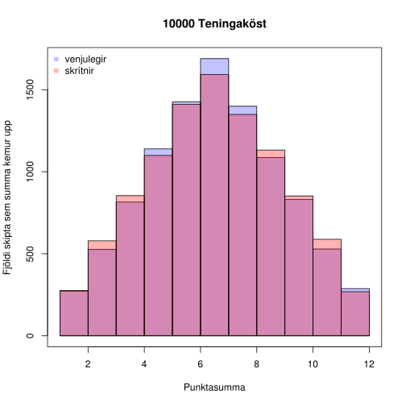

% Inngangur að líkindafræði
% Rúnar Berg Baugsson Sigríðarson; Tómas Ari Gíslason
% 20. mars 2014

Dæmi 17
=======

Stöng sem er metri að lengd er skipt í tvennt af handahófi. Sem sagt
brotapunkturinn $X$ hefur jafna dreifingu á $[0, 1]$.  er vinstri
hlutanum aftur skipt af handahófi með nýjum brotapunkti $Y$.

Ákvörðum skilyrta þéttleika $Y$ gefið $X = x$
---------------------------------------------

Þegar stöngin hefur verið brotin í $x$ hefur $Y$ jafna dreifingu á
$[0,x]$ sem gefur okkur samþéttifallið
$$
  f(y,x) = \frac{1}{x-0} = \frac{1}{x}
$$
ef $0 \leq y \leq x$ en $0$ annars.

Við höfum að skilyrtur þéttleiki $Y$ gefið $X = x$ er
$$
  f_{Y \mid X=x}(y) = \frac{f(y,x)}{f_X(x)}
$$
þar sem $f_X(x) = \frac{1}{1-0} = 1$ ef $0 \leq x \leq 1$, en $0$
annars. Og við höfum þá svarið
$$
  f_{Y \mid X=x}(y) = \frac{1/x}{1} = \frac{1}{x},
  \quad 0 \leq y \leq x \leq 1
$$
en $0$ annars.

Ákvörðum skilyrt væntigildi $Y$ gefið $X = x$, þ.e. $E[Y \mid X=x]$
-------------------------------------------------------------------

Við reiknum
$$
\begin{align}
  E[Y \mid X=x] &= \int_{-\infty}^{\infty} yf_{Y \mid X=x}(y)dy \\
                &= \int_0^x y\frac{1}{x}dy \\
                &= \left[\frac{1}{2x}y^2\right]_{y=0}^x \\
                &= \frac{x^2}{2x} = \frac{x}{2}.
\end{align}
$$

Ákvörðum væntigildi $Y$
-----------------------

Væntigildi $Y$ er háð $X$ svo skrifum
$$
  E[Y \mid X] = g(X)
$$
þar sem
$$
  g(X = x) = E[Y \mid X=x] = \frac{x}{2}
$$

Verkefni 6: Fleiri skrýtnir teningar
====================================

Í þessu dæmi ætlum við að skoða venjulega sex hliða teninga ásamt sex
hliða teningunum
$$
\begin{align}
  η &: 1, 2, 2, 3, 3, 4 \\
  θ &: 1, 3, 4, 5, 6, 8.
\end{align}
$$

Köllum slembistærðina sem er útkoma úr teningakasti venjulegs sex
hliða tenings $D$ og köllum slembistærðirnar sem eru útkomur úr $η$ og
$θ$ einfaldlega $D_η$ og $D_θ$. Við höfum sérstakan áhuga á summu
útkoma úr tveimur köstum venjulegra sex hliða teninga, köllum þær
stærðir $D_1$ og $D_2$ og summan er þá $X = D_1 + D_2$. Látum að sama
skapi $Y = D_η + D_θ$.  Okkur grunar að slembistærðirnar $X$ og $Y$ séu
keimlíkar! Leysum fyrstu tvo liðina og reynum við (c)-lið.

Reiknum væntigildi og útkomurúm $X$ og $Y$
------------------------------------------

Byrjum á að skoða útkomurúmin með því að nota R


```r
n <- 1:6
η <- c(1, 2, 2, 3, 3, 4)
θ <- c(1, 3, 4, 5, 6, 8)

rúm_X <- sort(outer(n, n, "+"))
rúm_Y <- sort(outer(η, θ, "+"))

show(rúm_X)
```

```
##  [1]  2  3  3  4  4  4  5  5  5  5  6  6  6  6  6  7  7  7  7  7  7  8  8
## [24]  8  8  8  9  9  9  9 10 10 10 11 11 12
```

```r
show(rúm_Y)
```

```
##  [1]  2  3  3  4  4  4  5  5  5  5  6  6  6  6  6  7  7  7  7  7  7  8  8
## [24]  8  8  8  9  9  9  9 10 10 10 11 11 12
```

```r
show(all(rúm_X == rúm_Y))
```

```
## [1] TRUE
```


Svo útkomurúm $X$ og $Y$ eru þau sömu.

Reiknum nú væntigildin.
$$
\begin{align}
  E[D] &= \sum_{i \in D} iP(D=i) \\
       &= \frac{1+2+3+4+5+6}{6} = \frac{21}{6} = \frac{7}{2}.
\end{align}
$$
Nýtum okkur að $X = D_1 + D_2 = 2D$, svo
$$
  E[X] = E[2D] = 2E[D] = 7.
$$

Reiknum svo
$$
\begin{align}
  E[D_η] &= \sum_{i \in D_η} iP(D_η=i) \\
       &= \frac{1+2+2+3+3+4}{6} = \frac{15}{6} = \frac{5}{2}.
\end{align}
$$
og
$$
\begin{align}
  E[D_θ] &= \sum_{i \in D_θ} iP(D_θ=i) \\
       &= \frac{1+3+4+5+6+8}{6} = \frac{27}{6} = \frac{9}{2}.
\end{align}
$$
og því
$$
  E[Y] = E[D_η + D_θ] = E[D_η] + E[D_θ] = \frac{5}{2} + \frac{9}{2} = 7.
$$

Svo væntigildi $X$ og $Y$ eru einnig þau sömu.

Sýnum að dreifing $Y$ sé sú sama og dreifing $X$
------------------------------------------------

Byrjum á að reikna dreifingu $D$.
$$
  E[D^2] = \frac{1+4+9+16+25+36}{6} = \frac{91}{6}
$$
$$
  \mathrm{var}[D] = E[D^2] - \big(E[D]\big)^2
                  = \frac{91}{6} - \frac{49}{4}
                  = \frac{35}{12}.
$$
Og þar sem $D_1$ og $D_2$ eru óháðar getum við reiknað
$$
    \mathrm{var}[X] = \mathrm{var}[D_1] + \mathrm{var}[D_2]
                    = \frac{35}{6}
$$
Núna leikum við sama leikinn fyrir $D_η$ og $D_θ$
$$
  E[D_η^2] = \frac{1+4+4+9+9+16}{6} = \frac{43}{6}
$$
$$
  \mathrm{var}[D_η] = E[D_η^2] - \big(E[D_η]\big)^2
                    = \frac{43}{6} - \frac{25}{4}
                    = \frac{11}{12}.
$$
$$
  E[D_θ^2] = \frac{1+9+16+25+36+64}{6} = \frac{151}{6}
$$
$$
  \mathrm{var}[D_θ] = E[D_θ^2] - \big(E[D_θ]\big)^2
                    = \frac{151}{6} - \frac{81}{4}
                    = \frac{59}{12}.
$$
$D_η$ og $D_θ$ eru óháðar svo
$$
  \mathrm{var}[Y] = \mathrm{var}[D_η] + \mathrm{var}[D_θ]
                  = \frac{11}{12} + \frac{59}{12} = \frac{35}{6}
                  = \mathrm{var}[X]
$$

Og ef við viljum nota R til að komast að sömu niðurstöðum þá


```r
B <- 10000  #ítranir
köst_X <- sample(n, B, replace = TRUE) + sample(n, B, replace = TRUE)
köst_Y <- sample(η, B, replace = TRUE) + sample(θ, B, replace = TRUE)

show(summary(köst_X))
```

```
##    Min. 1st Qu.  Median    Mean 3rd Qu.    Max. 
##    2.00    5.00    7.00    6.98    9.00   12.00
```

```r
show(summary(köst_Y))
```

```
##    Min. 1st Qu.  Median    Mean 3rd Qu.    Max. 
##    2.00    5.00    7.00    7.03    9.00   12.00
```

```r

show(var(köst_X))
```

```
## [1] 5.805
```

```r
show(var(köst_Y))
```

```
## [1] 5.831
```


Og berum þær svo saman myndrænt í lokin


```r
hist_X <- hist(köst_X, breaks = 1:12, plot = FALSE)
hist_Y <- hist(köst_Y, breaks = 1:12, plot = FALSE)
colors = c(rgb(0, 0, 1, 0.24), rgb(1, 0, 0, 0.3))
plot(hist_X, col = colors[1], main = paste(B, "Teningaköst", sep = " "), ylab = "Fjöldi skipta sem summa kemur upp", 
    xlab = "Punktasumma")
plot(hist_Y, col = colors[2], add = TRUE)
box()
legend("topleft", c("venjulegir", "skrítnir"), col = colors, pch = 15, bty = "n")
```

 

